# Deploying a monorepo to Railway

## Why would you want to use a monorepo structure?

A monorepo structure makes it easy to deploy two co-dependent applications to Railway, such as a frontend and backend, along with being very maintainable.

## About this Tutorial

For people new to the platform deploying a monorepo can sometimes be a little daunting because of the extra configurations needed to get the applications up and running smoothly compared to a repository with only a single app. This tutorial aims to provide a simple step-by-step on how to deploy a monorepo.

To demonstrate the process we will be going through, a simple monorepo has been prepared -

https://github.com/railwayapp-templates/monorepo-example

This contains a frontend built with [React](https://react.dev/) and [Vite](), the static files are served with [Caddy](https://caddyserver.com/), and a backend built with [Go](https://go.dev/)

The backend in this monorepo will stream quotes that will be displayed on the frontend.

While this tutorial shows how to deploy a frontend and backend from a monorepo since that is often the most commonly deployed type of monorepo, the procedure outlined can easily be adapted slightly to deploy different apps that are contained within a monorepo as well.

**Objectives**

In this tutorial, you will learn how to -

- Create an empty project.
- Rename a project.
- Create empty services.
- Rename services.
- Generate domains for services.
- Set variables on a service.
- Connect a GitHub repo to a service. 

**Prerequisites**

To be successful using this tutorial, you should already have -

- A monorepo that follows the same structure as the [example repo](https://github.com/railwayapp-templates/monorepo-example).

**Let's get started!**

## 1. Create a new empty project

- From [your dashboard](https://railway.app/dashboard) click `+ New Project`

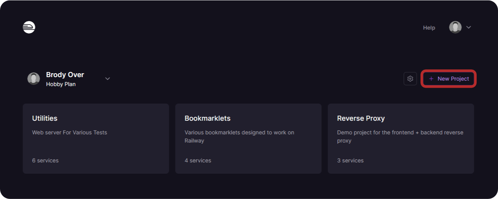

- Choose `Empty project`

    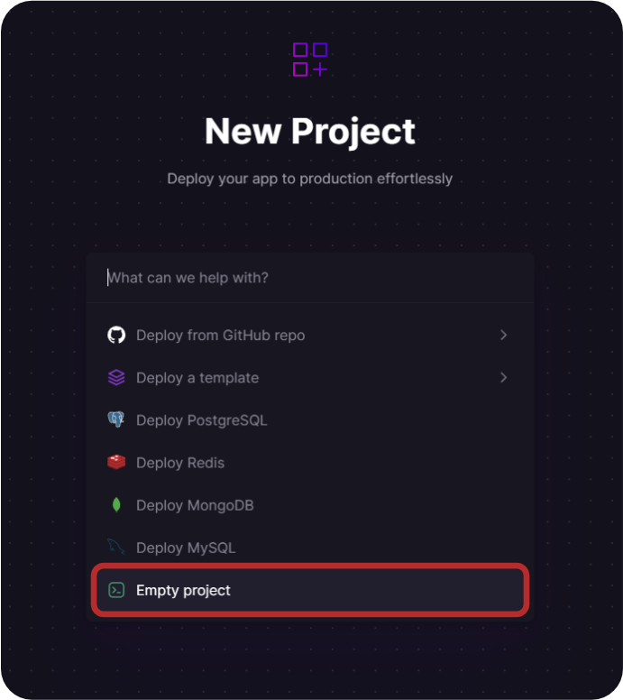

    **Note:** We chose an empty project instead of deploying from a GitHub repo since we want to set up the project before deploying.

## 2. Project setup

- Give the project an applicable name, this makes the project recognizable when in your dashboard, This can be done through the `Settings` button on the top right of the page.

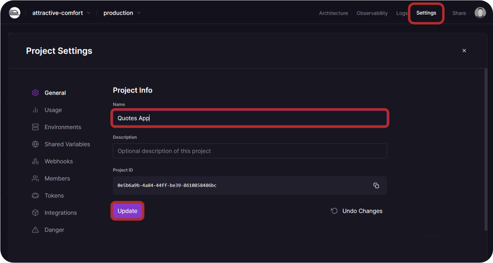

- Click `Update`

## 3. Service creation

- Add **two** new **empty** services from the `+ Create` button in the top right of the project canvas.

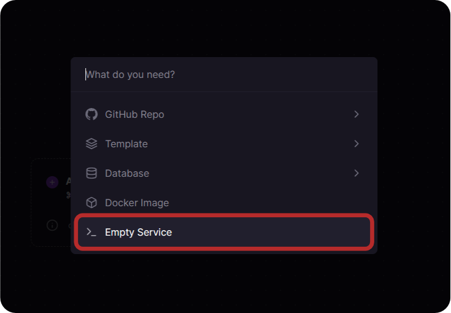

**Note:** We chose an empty service instead of deploying from a GitHub repo since we want to set up the service before deploying.

The result will look like this -

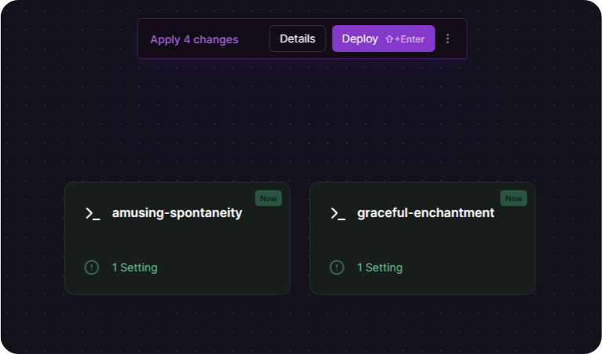

- Give them both applicable names.

    **Note:** This can be done easiest via the right-click context menu.

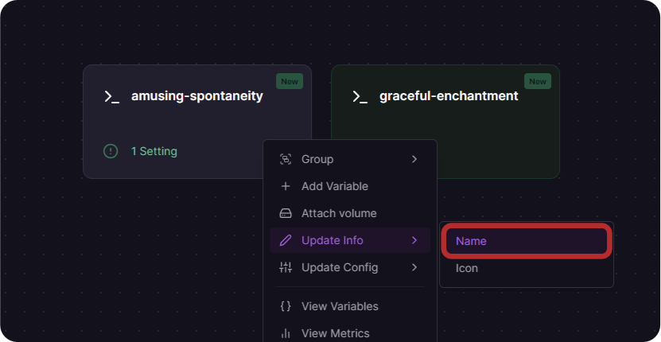

In the case of this tutorial, they will be named `Frontend` and `Backend`

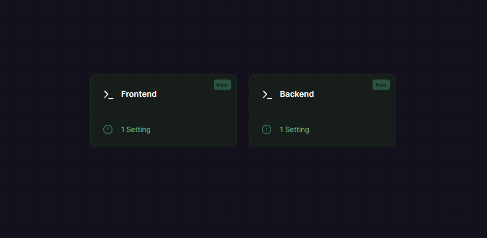

- Click the `Deploy` button to create these two services.

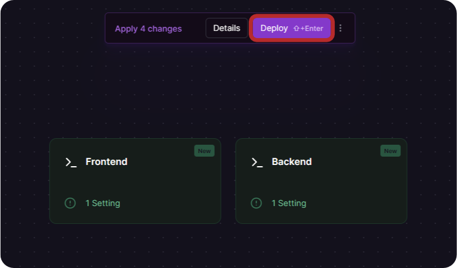

## 4. Domain setup

Both of these services will need to be exposed publicly, so let's add public domains to both of them -

- Click on the service and then open its settings menu.

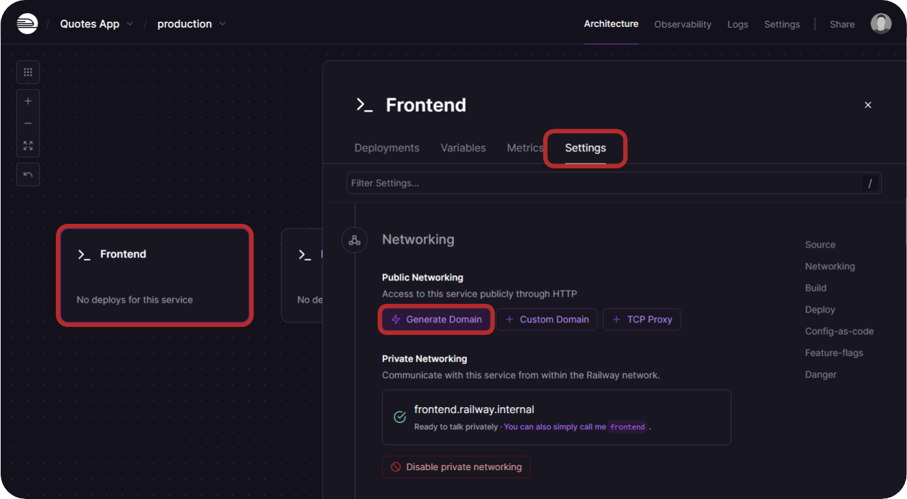

- Click on `Generate Domain` 

- Do these steps for the other service too, so that both services have public domains.

## 5. Variable setup

For our example monorepo the Frontend service needs a `VITE_BACKEND_HOST` variable, and our backend needs an `ALLOWED_ORIGINS` variable.

- Click on Frontend service and then the `Variables` tab.

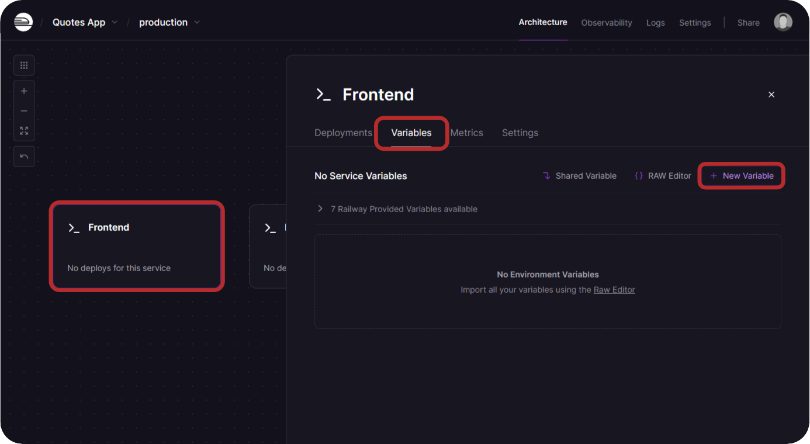

- Add your needed variables to both services.

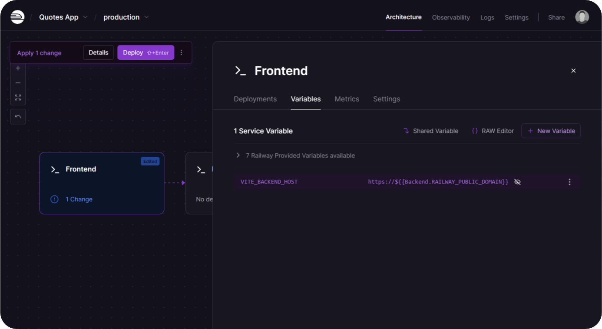

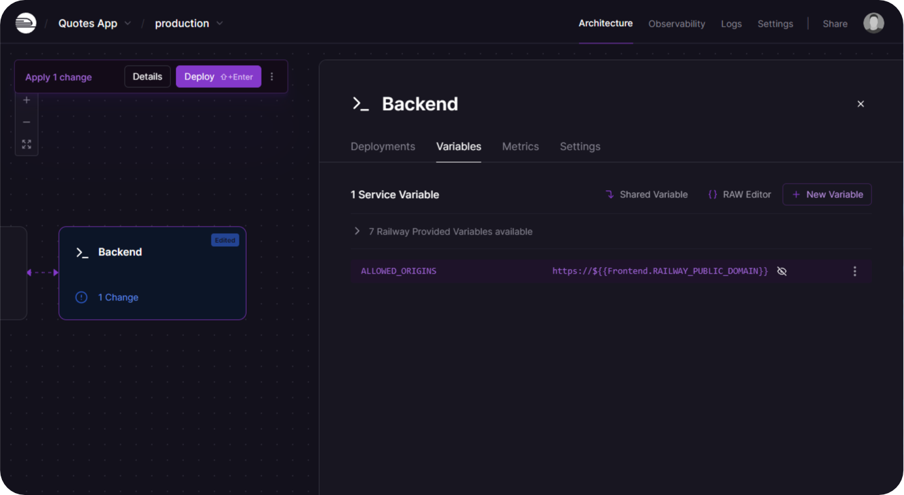

- Click the `Deploy` button to save these changes.

**Notes:**

The variables shown here are reference variables, learn more about them [here](https://docs.railway.app/guides/variables#referencing-another-services-variable).

In both of the variables we used on the Frontend and Backend they are referencing each other's public domains, that `RAILWAY_PUBLIC_DOMAIN` variable will automatically be updated when you deploy / re-deploy a service.

See a list of additional variables [here](https://docs.railway.app/reference/variables#railway-provided-variables).

## 6. Directory setup

Both of our apps deploy from subdirectories, so we need to tell Railway where they are located.

- Open the Frontend service to its service settings and you will see a **Root Directory** option, in this case, we will set it to `/frontend`

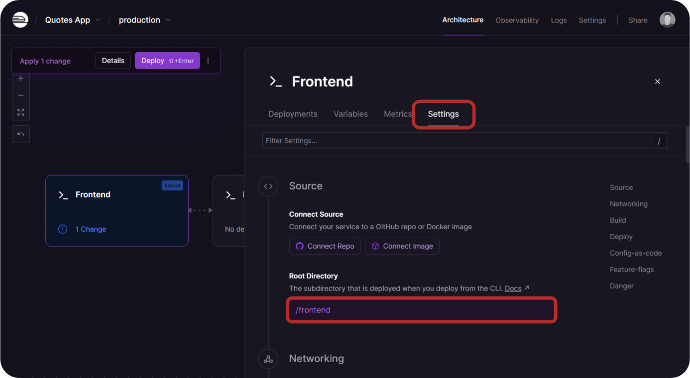

- Open the Backend service settings and we will set its root directory to `/backend`

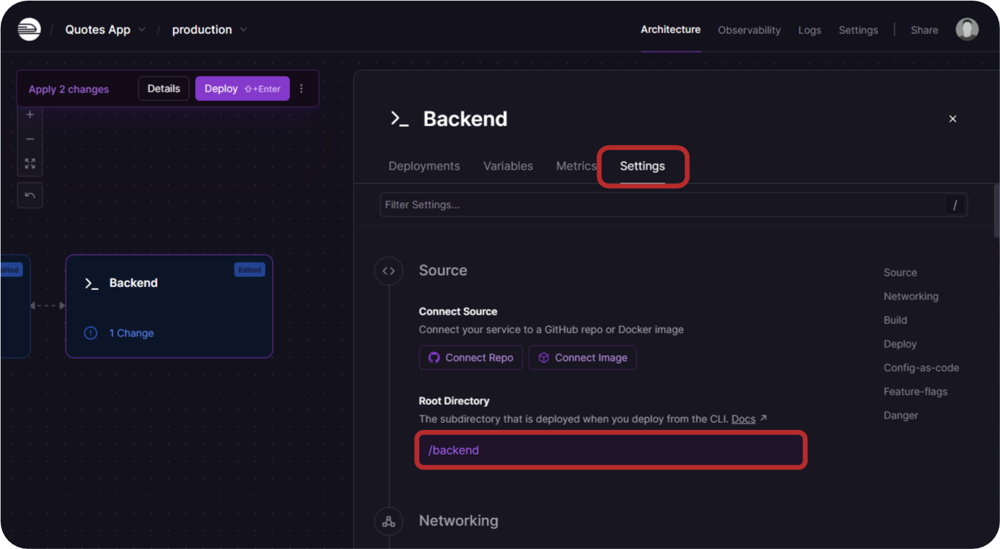

- Click the `Deploy` button to save these changes.

## 7. Connecting the Repo

This is the source of the service where the code is deployed.

- Open the service settings for each service and connect your monorepo.

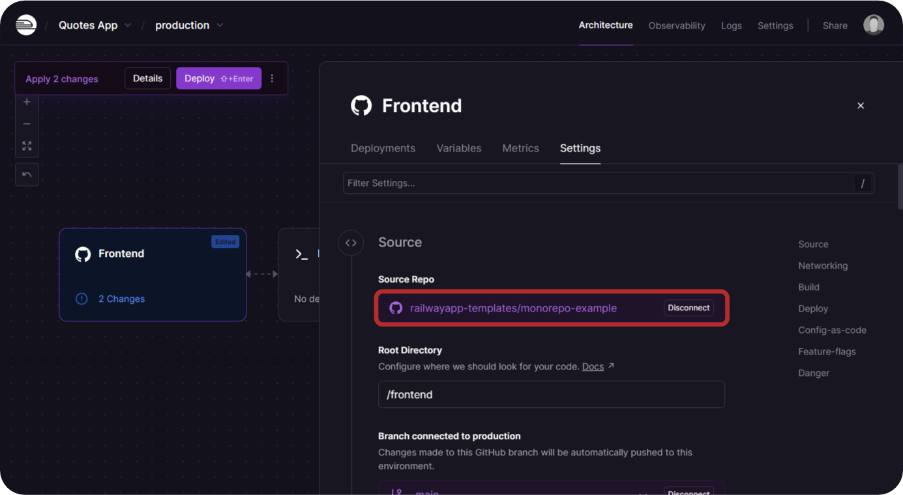

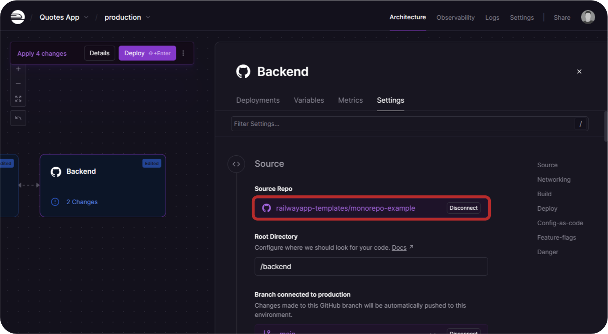

- Click the `Deploy` button to finally deploy your applications

**Your services should now start building and then deploy.**

## Conclusion

For this app, we would open up the Frontend service to then click on its public domain to access the deployed frontend website.

Congratulations! You have setup a project, setup services, added variables and deployed your monorepo project to Railway.